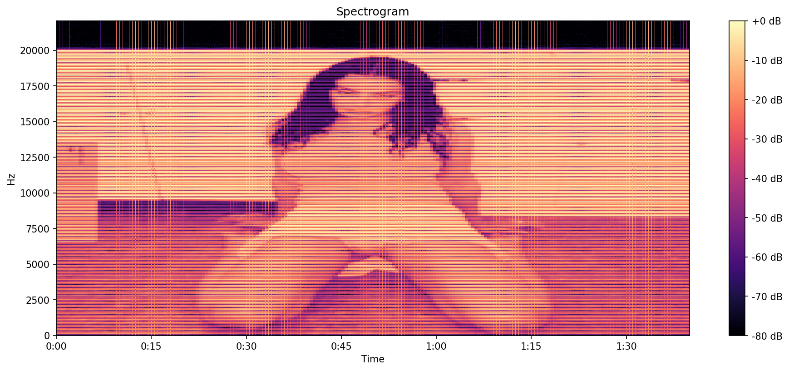
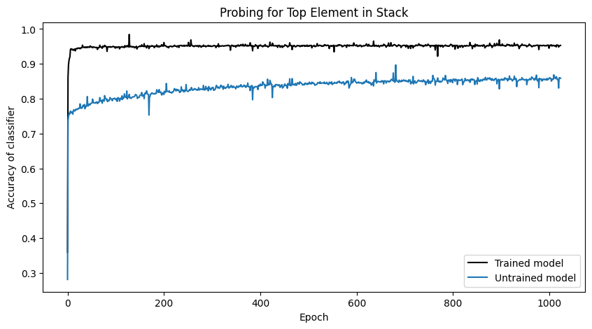
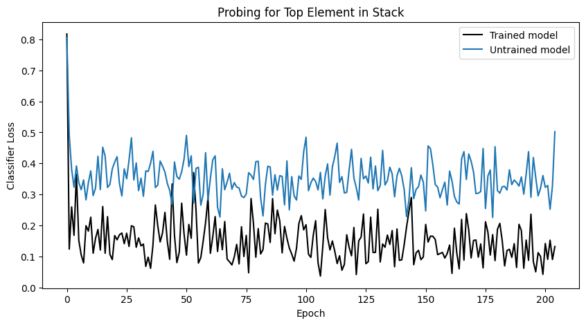
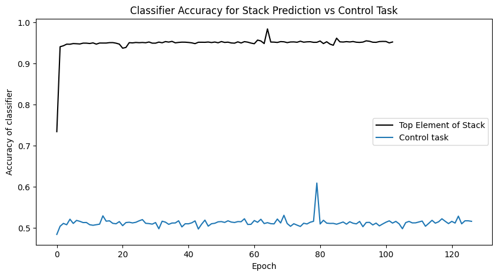
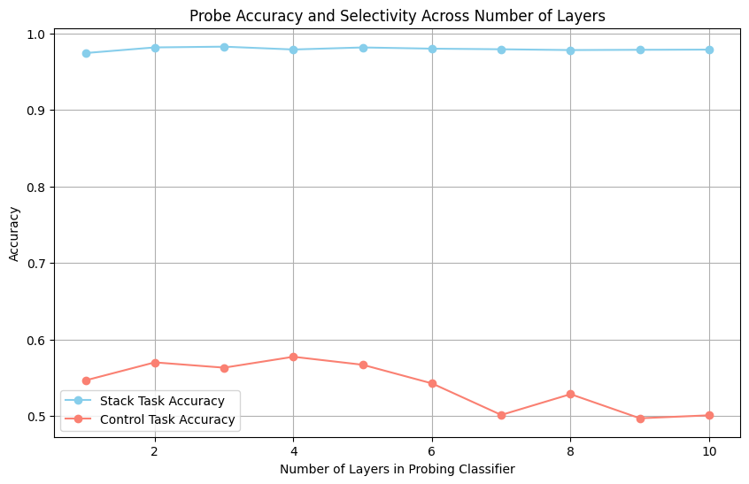

# Background

I try to maintain a blog but it requires a long time to write high quality interesting posts. So this space should work as a less formal dump for things I'm insterested in lately. I'll try to keep this as updated as possible. I don't claim to understand all the details of all the papers I mention here, instead, this serves as an archive of all the research directions I discovered and found interesting. 

# September 2024

## Learnability:

What can neural architectures (efficiently/practically/robustly/optimally) learn? What does using formal language learning (what is a good downstream task to see if a model has "learnt" a language? classification? prediction? something else?) as a sandbox tell us about inductive biases of modern neural nets?

1. [Why are Sensitive Functions Hard for Transformers?](https://arxiv.org/pdf/2402.09963) _M. Hahn, M. Rofin_
2. [The Expressive Capacity of State Space Models: A Formal Language Perspective](https://arxiv.org/pdf/2405.17394) _Sarrof et. al._ 
3. [ON THE TURING COMPLETENESS OF MODERN NEURAL NETWORK ARCHITECTURES](https://arxiv.org/pdf/1901.03429) _Perez et. al._
4. [InversionView: A General-Purpose Method for Reading Information from Neural Activations](https://arxiv.org/pdf/2405.17653) _Huang et. al._
5. [What Algorithms can Transformers Learn? A Study in Length Generalization](https://arxiv.org/pdf/2310.16028) _Zhou et. al._
6. [A Survey of Neural Networks and Formal Languages](https://arxiv.org/pdf/2006.01338) _Ackerman et. al._
7. [What Formal Languages Can Transformers Express? A Survey](https://arxiv.org/pdf/2311.00208) _Strobl et. al._
8. [NEURAL NETWORKS AND THE CHOMSKY HIERARCHY](https://arxiv.org/pdf/2207.02098) _Delétang et. al._
9. [On the Ability and Limitations of Transformers to Recognize Formal Languages](https://aclanthology.org/2020.emnlp-main.576/) _Bhattamishra et.al_

## Boolean Functions, Automata, and Neural Approximations

Hahn in [1] explains why sensitive functions are difficult to approximate (learn) for transformers, but what is (formally) sensitivity of a boolean function? A neural net, with a intput and outputs in {0,1} with a step activation function is basically a boolean function, where each neuron acts as a boolean gate (binary inputs and outputs due to the step function), so can we retrieve the explicit boolean function it has learnt? Can we extend this to sequence modelling architecures (like transformers and RNNs) to extract an Ordered Binary Decision Diagrams (OBDDs) and how similar are these to finite automatas used to model regular languages? Is this useful? How much and for what languages does the position encoding of input tokens help? Does one kind of encoding technique work better than the rest? Can we formalise these results are a general metric to benchmark robustness and inductive biases of different architectures?

1. [On Tractable Representations of Binary Neural Networks](https://arxiv.org/abs/2004.02082) _Shi et. al._
2. [Extracting Propositions from Trained Neural Networks](https://www.ijcai.org/Proceedings/97-2/Papers/045.pdf) _Tsukimoto et. al._
3. [Logic for Explainable AI](https://arxiv.org/abs/2305.05172) _Darwiche_

Longer books on the subject:

1. [ANALYSIS OF BOOLEAN FUNCTIONS by Ryan O’Donnell](https://arxiv.org/pdf/2105.10386)
2. [Formal Language Theory Meets Modern NLP by William Merrill](https://arxiv.org/pdf/2102.10094)
3. The textbooks for the TOC course at BITS

## Projects

A few things I have half completed :')

1. Aphex Twin made his music using Metasynth using which, among other things, you can use images as spectograms to create sound (which is pretty cool and unique). 

  

    
    
Aphex Twin Spectogram from his song colloquially called Formula

  

  

    
    
Charli XCX Spectrogram made from the program

  

However, Metasynth costs so much and surprisingly there is no open source alternative. So I made one. Kind of. It can fully take in an image as input, and generate sound. For example look at these photos of Charli XCX as a spectogram.

I'll upload the code once I add more functionality to add harmonies and image filters and have finer control over the parameters.

2. Pink List India has a very useful dataset of Indian politicians and their statements and stances on queer issues. Could something useful and fun be done with that data?

3. The BITS library has a LOT of books and they are located by hall number, shelf number, row number, etc. Can we find the latent space embeddings of the titles of all these books using a large pre trained backbone and find the similarity scores of books that are located close to each other? I just want to see if I can make some cool visualisations out of it. Same for faces: can I find dopplegangers of my friends by projecting photos of their faces in a higher dimensions then querying the highest cosine similarity ones. This is made more interesting by the fact that BITS collected photos of everyone's faces for the automated signing out of gates. Can I pwease get all that private data NS sir?

# October 2024

## Readings

1. [Deep Learning Course at NYU Centre for Data Science](https://atcold.github.io/NYU-DLSP21/) _by Yann LeCun & Alfredo Canziani_
2. [Thinking Like a Transformer blog by Sasha Rush on the original paper of the same name by Weiss et. al.](https://srush.github.io/raspy/)
3. [Transformers as Transducers](https://arxiv.org/pdf/2404.02040) _Stroba et. al._
4. [EMERGENT WORLD REPRESENTATIONS: EXPLORING A SEQUENCE MODEL TRAINED ON A SYNTHETIC TASK or Othello-GPT](https://arxiv.org/pdf/2210.13382) _Li et. al._ also see the [explainer blog](https://thegradient.pub/othello/) by Kenneth Li and the [extension blog](https://www.neelnanda.io/mechanistic-interpretability/othello#neuron-interpretability-and-studying-superposition) by Neel Nanda 
5. [The Linear Representation Hypothesis and the Geometry of Large Language Models](https://arxiv.org/pdf/2311.03658) _Park et. al._
6. [Evaluating the World Model Implicit in a Generative Model](https://arxiv.org/pdf/2406.03689) _Vafa et. al._
7. [A FORMAL FRAMEWORK FOR UNDERSTANDING LENGTH GENERALIZATION IN TRANSFORMERS](https://www.arxiv.org/pdf/2410.02140) _Huang et. al._
8. [This very cool blog post on breeding cellular automata](https://pentagonalize.github.io/blog_posts/cellular_automata/cellular_automata.html)
9. [The Geometry of Concepts: Sparse Autoencoder Feature Structure](https://arxiv.org/abs/2410.19750) _Li et. al._
10. [Probing Classifiers: Promises, Shortcomings, and Advances](https://arxiv.org/pdf/2102.12452) _Yonatan Belinko_

## Misc Thoughts

This month I also thought a lot about archives. I found my old emails, old letterboxd logs, old word doc journals, and so on, and it was such a trip for reasons stronger than nostalgia. I could trace the origins of my personality, politics, tastes, and interest in real time. It's very sad that I haven't archived my life with as much ferocity in college as I had before so the only repository of change is in the imperfect memory storage of my brain. This blog at least acts as an archive of my academic evolution. 

This month I dyed my hair twice: first a light and barely noticeable red, and then bleached them before putting on a bright pink, something I had wanted to do since my first year and finally decided to go for it after I saw a tweet of Alfredo Canziani with an offensively pink head. I also recorded a podcast episode with Professor Jagat S. Challa which can be heard [here](https://open.spotify.com/episode/3ZIzmrevw5k37Fhn0dVWmT?si=c874fead83514124)

# November 2024

## Readings
1. [Blog posts](https://nicholas.carlini.com/writing) by Nicholas Carlini, especially the ones on [building a CPU using Conway's Game of Life](https://nicholas.carlini.com/writing/2020/intro-to-circuits-game-of-life.html) and on [breaking (buggy) defenses](https://nicholas.carlini.com/writing/2024/yet-another-broken-defense.html)
2. [Interpreting and Editing Vision-Language Representations to Mitigate Hallucinations](https://anishk23733.github.io/vl-interp/) _Jiang et. al._
3. [Lenia](https://chakazul.github.io/lenia.html) multiple papers on multiple variants
4. [What Formal Languages Can Transformers Express? A Survey](https://arxiv.org/pdf/2311.00208) A very useful paper by _Strobl et. al._
5. [Convolutional Differentiable Logic Gate Networks](https://arxiv.org/abs/2411.04732) by _Petersen et. al._
6. [Deep Differentiable Logic Gate Networks](https://arxiv.org/pdf/2210.08277) by _Petersen et. al._ (without discounting the authors - sometimes you come across things which feel so natural once theyre done that you think why didnt i think of that)
7. [Learning Elementary Cellular Automata with Transformers](https://openreview.net/forum?id=rROdzn4DSb) by _Mikhail Burtsev_
8. [Transition-based Parsing with Stack-Transformers](https://aclanthology.org/2020.findings-emnlp.89/) by _Astudillo et. al._
9. [Climbing towards NLU: On Meaning, Form, and Understanding in the Age of Data](https://aclanthology.org/2020.acl-main.463.pdf) by by _Bender et. al._
10. [Transformer-Based Models Are Not Yet Perfect At Learning to Emulate Structural Recursion](https://arxiv.org/pdf/2401.12947v1) by _Zhang et. al._
11. [Analyzing (In)Abilities of SAEs via Formal Languages](https://www.arxiv.org/pdf/2410.11767) by _Menon et. al._
12 [Sparse Autoencoders Enable Scalable and Reliable Circuit Identification in Language Models](https://arxiv.org/pdf/2405.12522v1) by _O’Neill et. al._

## Misc Thoughts

3rd Nov: Based on some of the papers I mentioned in October, this is what I have been thinking about - the ideas are very underdeveloped. I'd love to chat about these if you have any insights:

### World Models - 
Othello-GPT: In the [emergent world models paper](https://arxiv.org/pdf/2210.13382) the authors use non-linear probing classifiers to prove that a world model emerges, and then make changes to the internal state representations(causal interventions) and observe changes in the outcome to prove that this world model is used for inference. 

Neel Nanda, in an [extension work](https://www.neelnanda.io/mechanistic-interpretability/othello) on the model, proves that the world is in fact linear and can be retrieved by linear probes.

[A case study paper on Othello GPT](https://arxiv.org/pdf/2310.07582) further explores this linear world model, and develops novel causal intervention techniques. The authors also explore the dependence of the world model on the (hyper)params of the model like depth and complexity (for example, they find that “world representations may be linearly encoded in the model’s activations to an extent that generally increases with layer depth for deeper models” and that “semantic understanding in the model is developed and utilized about halfway through the model.”)

[A similar work on Cellular Automata called Life GPT](https://arxiv.org/pdf/2409.12182) was recently published to arxiv where the authors train a decoder only GPT model to simulate Conway’s Game of Life (life) on a toroidal grid (meaning that the cells on the edges loop back in neighborhood definitions) with high accuracy, meaning that the model has learned the deterministic Turing Complete rules, since life is turing complete. It might be interesting to see if a world model emerges in Life GPT and then study its characteristics and use previously mentioned causal intervention techniques. It might also be useful to train a similar model on a non-Turing Complete cellular automata (if I am not mistaken rule 90 is not turing complete) and see if there are any meaningful differences to exploit. This would be similar to previous works on learnability of different classes of formal languages (regular vs context free vs context sensitive, can transformers simulate a stack, etc.). [This work](https://arxiv.org/pdf/2406.03689) on a formalized framework for evaluating a world model when the ground truth world model is a deterministic finite automaton may be useful here. In general, it might be useful to extract world models for models trained on formal languages to see if they learn the correct internal representation, and if they then which one (DFA vs NDFA vs Context free grammar) 

Is there also a causal relationship between the linearity or non-linearity of the world models and the class of language it is trained on?

The papers on [Platonic Representation Hypothesis](https://arxiv.org/abs/2405.07987) and [Disentangling Representations](https://arxiv.org/pdf/2407.11249) may also be helpful, but I'm not sure how.

### Emergent Stacks(?) - 
We know from [1](https://openreview.net/pdf?id=yyffl6d3byq) and [2](https://arxiv.org/pdf/1906.06755) that $a^nb^n$, a context free language modelled by a stack, is learnable by a transformer, but that other CFLs like $Dyck$ (well formed parenthesis) also modelled by stack operations are not learnable. Can you use probing classifiers to see if there is a stack in the internal representation of a model trained on $a^nb^n$? If so, will it contain a stack? If so, we know that stacks arent the bottleneck for learning CFLs but the "complexity" of the algorithm over the stack is. Kind of like this [joke](https://www.google.com/url?sa=i&url=https%3A%2F%2Fph.pinterest.com%2Fpin%2Fpjevans-ayevans-cars-have-windows-and-can-move-houses-have-windows-and-cant-move-so-its-not-the-windows-that-make-the-car-go-its-something-else-entirely-2--423831014942937211%2F&psig=AOvVaw1JeYwz2gbl5lLVQXT22klc&ust=1731984741398000&source=images&cd=vfe&opi=89978449&ved=0CBQQjRxqFwoTCNDcw4vw5IkDFQAAAAAdAAAAABAE)

Preliminary experiments on seem to be promising:

  

    
  

  

    
  

  

    
  

  

    
  

