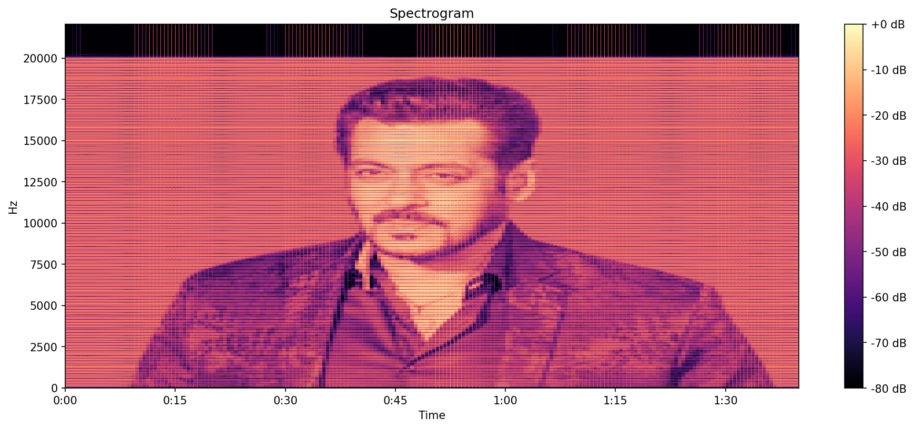

# Background

I try to maintain a blog but it requires a long time to write high quality interesting posts. So this space should work as a less formal dump for things I'm insterested in lately. I'll try to keep this as updated as possible.

# Last Update: [September 2024] 

# Learnability:

What can neural architectures (efficiently/practically/robustly/optimally) learn? What does using formal language learning (what is a good downstream task to see if a model has "learnt" a language? classification? prediction? something else?) as a sandbox tell us about inductive biases of modern neural nets?

1. [Why are Sensitive Functions Hard for Transformers?](https://arxiv.org/pdf/2402.09963) _M. Hahn, M. Rofin_
2. [The Expressive Capacity of State Space Models: A Formal Language Perspective](https://arxiv.org/pdf/2405.17394) _Sarrof et. al._ 
3. [ON THE TURING COMPLETENESS OF MODERN NEURAL NETWORK ARCHITECTURES](https://arxiv.org/pdf/1901.03429) _Perez et. al._
4. [InversionView: A General-Purpose Method for Reading Information from Neural Activations](https://arxiv.org/pdf/2405.17653) _Huang et. al._
5. [What Algorithms can Transformers Learn? A Study in Length Generalization](https://arxiv.org/pdf/2310.16028) _Zhou et. al._
6. [A Survey of Neural Networks and Formal Languages](https://arxiv.org/pdf/2006.01338) _Ackerman et. al._
7. [What Formal Languages Can Transformers Express? A Survey](https://arxiv.org/pdf/2311.00208) _Strobl et. al._
8. [NEURAL NETWORKS AND THE CHOMSKY HIERARCHY](https://arxiv.org/pdf/2207.02098) _Delétang et. al._
9. [On the Ability and Limitations of Transformers to Recognize Formal Languages](https://aclanthology.org/2020.emnlp-main.576/) _Bhattamishra et.al_

# Boolean Functions, Automata, and Neural Approximations

Hahn in [1] explains why sensitive functions are difficult to approximate (learn) for transformers, but what is (formally) sensitivity of a boolean function? A neural net, with a intput and outputs in {0,1} with a step activation function is basically a boolean function, where each neuron acts as a boolean gate (binary inputs and outputs due to the step function), so can we retrieve the explicit boolean function it has learnt? Can we extend this to sequence modelling architecures (like transformers and RNNs) to extract an Ordered Binary Decision Diagrams (OBDDs) and how similar are these to finite automatas used to model regular languages? Is this useful? How much and for what languages does the position encoding of input tokens help? Does one kind of encoding technique work better than the rest? Can we formalise these results are a general metric to benchmark robustness and inductive biases of different architectures?

1. [On Tractable Representations of Binary Neural Networks](https://arxiv.org/abs/2004.02082) _Shi et. al._
2. [Extracting Propositions from Trained Neural Networks](https://www.ijcai.org/Proceedings/97-2/Papers/045.pdf) _Tsukimoto et. al._
3. [Logic for Explainable AI](https://arxiv.org/abs/2305.05172) _Darwiche_

Longer books on the subject:

1. [ANALYSIS OF BOOLEAN FUNCTIONS by Ryan O’Donnell](https://arxiv.org/pdf/2105.10386)
2. [Formal Language Theory Meets Modern NLP by William Merrill](https://arxiv.org/pdf/2102.10094)
3. The textbooks for the TOC course at BITS

# Projects

A few things I have half completed :')

1. Aphex Twin made his music using Metasynth using which, among other things, you can use images as spectograms to create sound (which is pretty cool and unique). 

  

However, Metasynth costs so much and surprisingly there is no open source alternative. So I made one. Kind of. It can fully take in an image as input, and generate sound. For example look at these photos of Charli XCX and Salman Khan as spetograms lol

  

  

I'll upload the code once I add more functionality to add harmonies and image filters and have finer control over the parameters.

2. Pink List India has a very useful dataset of Indian politicians and their statements and stances on queer issues. Could something useful and fun be done with that data?

3. The BITS library has a LOT of books and they are located by hall number, shelf number, row number, etc. Can we find the latent space embeddings of the titles of all these books using a large pre trained backbone and find the similarity scores of books that are located close to each other? I just want to see if I can make some cool visualisations out of it. Same for faces: can I find dopplegangers of my friends by projecting photos of their faces in a higher dimensions then querying the highest cosine similarity ones. This is made more interesting by the fact that BITS collected photos of everyone's faces for the automated signing out of gates. Can I pwease get all that private data NS sir?